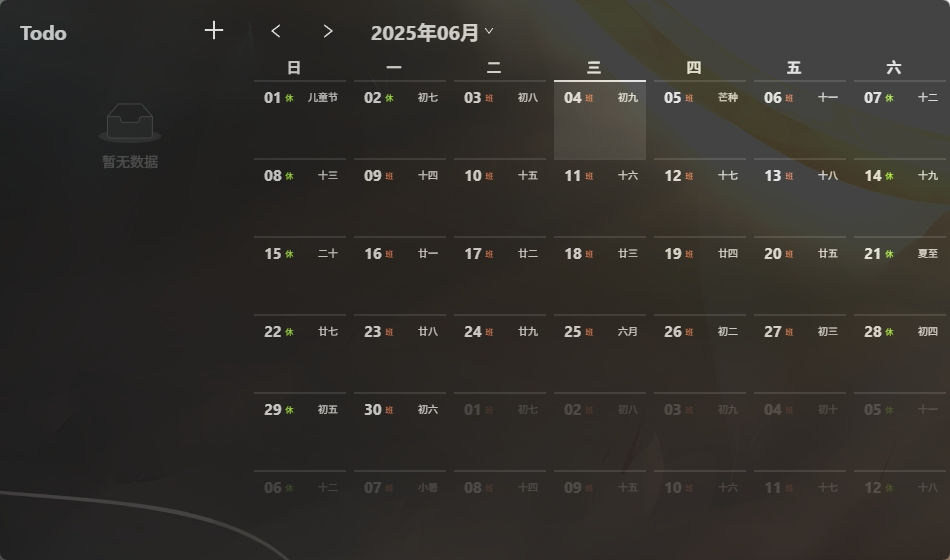

<h1 align="center">Simple Note 桌面版</h1>

一个基于 Tauri2.0 & Vue 开发的便笺软件

## 说明

所用技术栈：

- Tauri 2.2.5
- Vue 3.2

已支持的平台：

- Linux
- Windows 11

目前本项目的原始发布地址只有 [**GitHub**](https://github.com/illyasivel1314/simple-note/releases)，其他渠道均为第三方转载发布，与本项目无关！

### 数据同步服务

当前版本暂不支持数据同步，所有数据只会保存在本地，请注意

## 用户界面

## 贡献代码

本项目欢迎 PR，但为了 PR 能顺利合并，需要注意以下几点：

- 对于添加新功能的 PR，建议在提交 PR 前先创建 Issue 进行说明，以确认该功能是否确实需要。
- 对于修复 bug 的 PR，请提供修复前后的说明及重现方式。
- 对于其他类型的 PR，则适当附上说明。

## 源码使用方法

请参阅：日后补充

## 项目协议
---

### 一、数据来源

1.1 本项目只对数据简单地保存以及展示，因此本项目不对数据的合法性、准确性负责。

### 二、资源使用

2.1 本项目内使用的部分包括但不限于字体、图片等资源来源于互联网。如果出现侵权可联系本项目移除。

### 三、免责声明

3.1 由于使用本项目产生的包括由于本协议或由于使用或无法使用本项目而引起的任何性质的任何直接、间接、特殊、偶然或结果性损害（包括但不限于因商誉损失、停工、计算机故障或故障引起的损害赔偿，或任何及所有其他商业损害或损失）由使用者负责。

### 四、使用限制

4.1 本项目完全免费，且开源发布于 GitHub 面向全世界人用作对技术的学习交流。本项目不对项目内的技术可能存在违反当地法律法规的行为作保证。

4.2 **禁止在违反当地法律法规的情况下使用本项目。** 对于使用者在明知或不知当地法律法规不允许的情况下使用本项目所造成的任何违法违规行为由使用者承担，本项目不承担由此造成的任何直接、间接、特殊、偶然或结果性责任。

### 五、非商业性质

5.1 本项目仅用于对技术可行性的探索及研究，不接受任何商业（包括但不限于广告等）合作及捐赠。

### 六、接受协议

6.1 若你使用了本项目，即代表你接受本协议。

---

若对此有疑问请 mail to: illyasivel+aliyun.com (请将 `+` 替换为 `@`)